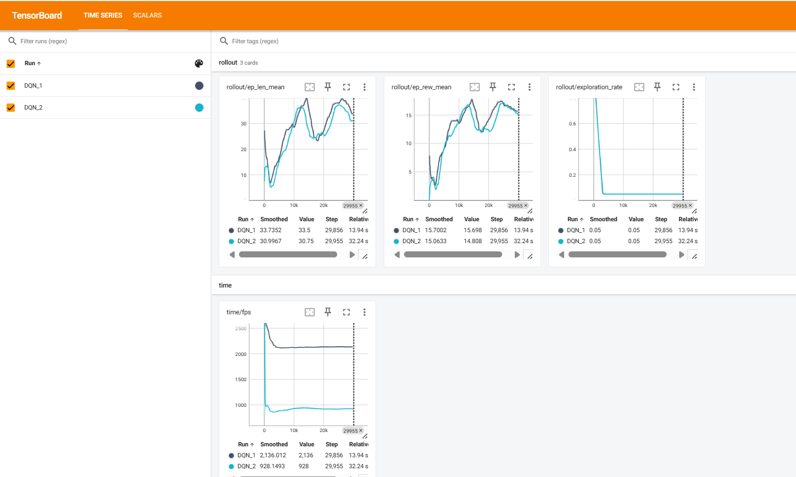

## 🤖 Reinforcement Learning for Autonomous Robot Navigation

**Gym-based environments | DQN | Embedded-aware design**

### Overview

This project explores the use of **Reinforcement Learning (RL)** for autonomous robot navigation.
It starts with a **minimal abstract environment** and progressively moves toward a **realistic multi-robot simulator**, while keeping **embedded-system constraints** in mind (low computation, small neural networks, FPGA/MCU compatibility).

The goal is to demonstrate a **complete RL pipeline**:
**environment modeling → training → evaluation → realistic simulation**.

---

###  Project Architecture

├── env_simple.py              # Minimal Gym environment (4 sensors, discrete actions)

├── train_dqn.py               # DQN training (small neural network)

├── simulateur.py              # Realistic 2D multi-robot simulator
│

├── export_weights.py          # Export trained NN weights for hardware use

├── quantize_and_coe.py        # Quantization + COE file generation (FPGA)
│

├── models/                    # Trained DQN models

├── logs/                      # TensorBoard logs

├── docs/

│   └── tensorboard_results.png

└── README.md


---

###  Simple Robot Environment (`env_simple.py`)

A lightweight **Gym-compatible environment** representing a robot with:

* **4 distance sensors**: front, left, right, rear
* **Discrete action space**: STOP, FORWARD, LEFT, RIGHT
* **Reward function** encouraging safe and efficient navigation

 Designed for:

* Fast experimentation
* Low-dimensional state space
* Compatibility with embedded inference (FPGA / MCU)

---

###  Reinforcement Learning Training (`train_dqn.py`)

* Algorithm: **Deep Q-Network (DQN)**
* Neural network architecture: **4 → 6 → 4**
* Implemented using **Stable-Baselines3**

The network is intentionally small to:

* Reduce memory usage
* Limit computational cost
* Prepare for hardware deployment

Training metrics are logged using **TensorBoard**.

---

### 3️ Realistic Multi-Robot Simulator (`simulateur.py`)

A custom 2D simulator featuring:

* Multiple robots (swarm)
* Differential-drive motion model
* LIDAR simulation
* Obstacles and goals
* Sensor and actuator noise
* Domain randomization
* Wi-Fi communication effects (latency & packet loss)
* Pygame-based visualization

This simulator bridges the gap between **abstract RL environments** and **real-world robotic constraints**.

---
### export_weights.py

* Extracts trained neural network weights from the DQN model
* Converts them into a hardware-friendly format
* Acts as a bridge between Python training and embedded deployment
---
### quantize_and_coe.py

* Applies fixed-point quantization to neural network parameters
* Generates COE files compatible with FPGA memory initialization
* Prepares the model for low-resource hardware inference
---

###  How to Run

#### Run the simple environment

```
python env_simple.py
```

#### Train the DQN agent

```
python train_dqn.py
```

#### Launch the simulator (visual mode)

```
python simulateur.py --mode demo
```

---

###  Key Skills Demonstrated

* Reinforcement Learning (DQN)
* Gym environment design
* Reward shaping
* Simulation of real-world uncertainties
* Embedded-aware AI design
* Autonomous navigation principles

---

### 📌 Future Work

* Transfer learning from simulation to real robot
* Continuous-action RL (PPO, SAC)
* Deployment on embedded hardware (FPGA / MCU)
* ROS 2 or Webots integration

---

###  Author

Project developed as an academic and research-oriented work in **robotics and embedded AI**.

---

##  Architecture globale du projet

```
┌──────────────────────────────┐
│   Simulation / Environment   │
│                              │
│  env_simple.py               │
│  simulateur.py               │
│                              │
│  Sensors / LIDAR / Noise     │
└──────────────┬───────────────┘
               │ Observation (State)
               ▼
┌──────────────────────────────┐
│ Reinforcement Learning Agent │
│                              │
│  train_dqn.py                │
│  DQN (4 → 6 → 4)             │
│                              │
│  TensorBoard Monitoring      │
└──────────────┬───────────────┘
               │ Trained Weights
               ▼
┌──────────────────────────────┐
│ Model Export & Optimization  │
│                              │
│  export_weights.py           │
│  quantize_and_coe.py         │
│                              │
│  Fixed-point / Quantization  │
└──────────────┬───────────────┘
               │ Hardware-ready NN
               ▼
┌──────────────────────────────┐
│ Embedded / FPGA Deployment   │
│   (Future or External)       │
└──────────────────────────────┘

```

---

##  Extension vers la simulation réaliste

```
Simple Env ──► Training ──► Simulator ──► Real Robot (future)
   (4 sensors)      (DQN)        (LIDAR, noise)
```

---

##  Training Monitoring with TensorBoard

Training performance is monitored using **TensorBoard**, which provides real-time visualization of the learning process during DQN training.

The following metrics are tracked:

* **Average episode reward (`rollout/ep_rew_mean`)**
  Shows the improvement of the agent’s navigation policy over time.

* **Average episode length (`rollout/ep_len_mean`)**
  Indicates that the agent survives longer without collision as training progresses.

* **Exploration rate (`rollout/exploration_rate`)**
  Demonstrates the transition from exploration to exploitation in the DQN algorithm.

* **Training speed (`time/fps`)**
  Confirms that the environment is lightweight and suitable for embedded-oriented experimentation.

### 📈 TensorBoard Results



**Interpretation:**
The curves show a clear increase in the average reward and episode length, while the exploration rate decreases progressively.
This confirms that the agent successfully learns a more efficient and safer navigation policy, despite using a very small neural network architecture.

---

##  How to Launch TensorBoard

```
pip install tensorboard
python train_dqn.py
tensorboard --logdir logs
```

Then open your browser at:

```
http://localhost:6006
```

---

> *TensorBoard results validate the effectiveness of the reinforcement learning approach and demonstrate stable convergence, making the solution suitable for further extension toward realistic simulation and embedded deployment.*

---


